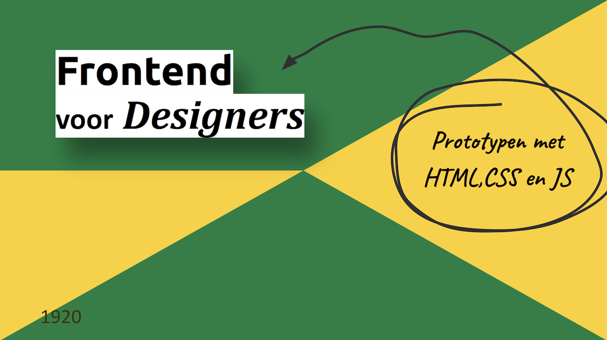

# Frontend voor Designers 1920

In het vak Frontend voor Designers leer je hoe je met HTML, CSS en Javascript prototypes kunt maken om je ontwerpideeën te testen in een browser. We gaan animeren, responsive layouts uitproberen en interactie coderen ...

Het vak bestaat uit 3 opdrachten:

1. [Opdracht 1: Een Micro-interactie uitwerken en testen](opdracht1/)
2. [Opdracht 2: Een interactie uitwerken voor verschillende gebruikers input](opdracht2/)
3. [Opdracht 3: Een interactie uitwerken met externe data](opdracht3/)

---
- [Markup cheat sheet](https://github.com/adam-p/markdown-here/wiki/Markdown-Cheatsheet)
- [Getting started with GitHub Pages](https://guides.github.com/features/pages/)
